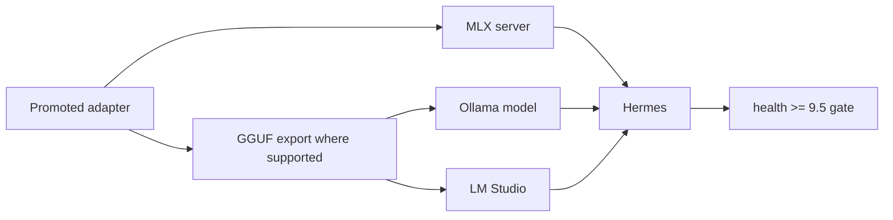

# Design — Ollama Pack

```mermaid
flowchart LR
    ADAPTER[Promoted adapter] --> MLX[MLX server]
    ADAPTER --> GGUF[GGUF export where supported]
    GGUF --> OLLAMA[Ollama model]
    GGUF --> LM[LM Studio]
    MLX --> HERMES[Hermes]
    OLLAMA --> HERMES
    LM --> HERMES
    HERMES --> HEALTH[health >= 9.5 gate]
```

Runtime packaging begins only after benchmark promotion.
